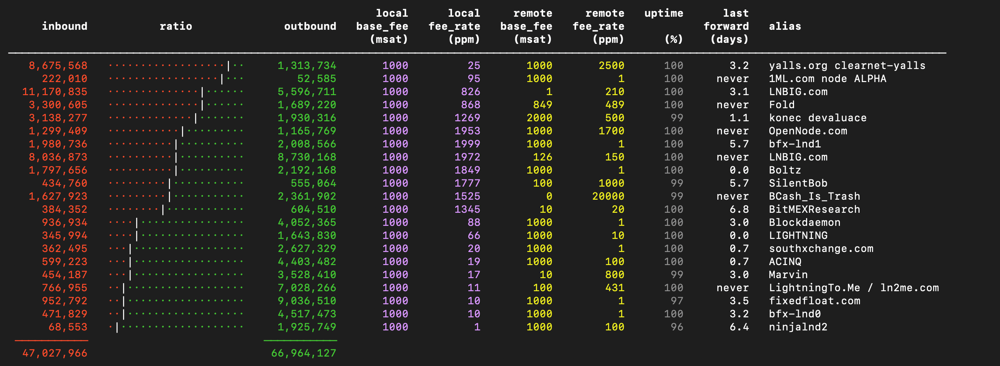

# Suez

Tool for pretty printing and optimizing Lightning Network channels.

## Channel fee policy

You can override the channel fee policy by changing the `FeePolicy` class.
Example implementation sets exponentially higher fees for channels with lower local balance than half of the channel capacity.
The steepness is controlled via the `fee_sigma` argument.

## Lightning node support

Currently, Suez only supports LND, but adding support for c-lightning and Eclair should be trivial.

## Donate

You can tip me some satoshis via [tippin.me/@pavolrusnak](https://tippin.me/@pavolrusnak)

## License

This software is licensed under the [GNU General Public License v3](COPYING).
