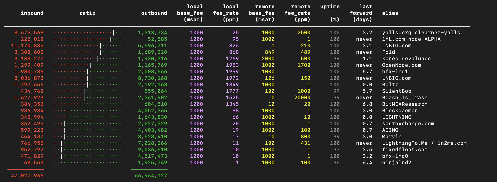

# Suez

Tool for pretty printing and optimizing Lightning Network channels.



## Features

* Displays channel balances with visual ratio bars, sorted by outbound liquidity
* Shows local and remote fee rates, base fees, uptime, last forward time, and earned fees
* Supports dynamic fee policy based on channel balance (incentivize rebalancing)
* Integrates with [Lightning Terminal](https://terminal.lightning.engineering/) for node scores and good peer detection
* Optionally displays HTLC limits, channel IDs, disabled status, and forwarding statistics
* Filter and split view for public/private channels
* Supports LND (via `lncli` and REST API) and Core Lightning (CLN)
* Color-coded output: local-opened channels in blue, remote-opened in yellow

## Installation

1. Install [uv](https://docs.astral.sh/uv/getting-started/installation/)
2. `uv sync`
3. `uv run ./suez`

## Usage

```
uv run ./suez [OPTIONS]
```

### Options

| Option | Default | Description |
|---|---|---|
| `--client` | `lnd` | Lightning client to use (`lnd`, `c-lightning`, `lnd-rest`) |
| `--client-args` | | Extra arguments to pass to the client CLI (repeatable) |
| `--base-fee` | `0` | Set base fee (msat) |
| `--fee-rate` | `0` | Set fee rate (ppm) |
| `--fee-spread` | `0.0` | Fee spread multiplier for balance-based fee adjustment |
| `--time-lock-delta` | `40` | Set time lock delta |
| `--channels` | `all` | Which channels to show (`all`, `public`, `private`, `split`) |
| `--show-remote-fees` | off | Show estimate of remote fees earned |
| `--show-scores` | off | Show node scores from Lightning Terminal |
| `--show-good-peers` | off | Show good inbound/outbound peers from Lightning Terminal |
| `--show-chan-ids` | off | Show channel IDs |
| `--show-forwarding-stats` | off | Show forwarding counts and success percentages (CLN) |
| `--show-minmax-htlc` | off | Show min and max HTLC amounts |
| `--show-disabled` | off | Show whether channels are disabled |

Options can also be set via environment variables with the `SUEZ_` prefix (e.g. `SUEZ_FEE_RATE=500`).

## Channel fee policy

You can set channel fees by passing `--base-fee` and `--fee-rate` parameters:

```
uv run ./suez --base-fee 1000 --fee-rate 200
```

The fee policy adjusts rates based on each channel's balance using `--fee-spread`:

* Channels with mostly **local** balance get a **lower** fee rate (encourage outbound flow)
* Channels with mostly **remote** balance get a **higher** fee rate (discourage outbound flow)
* **Balanced** channels stay close to the specified fee rate

The spread is controlled by `--fee-spread` (default `0.0` = no spread). For example:

```
uv run ./suez --base-fee 1000 --fee-rate 500 --fee-spread 1.8
```

You can customize the fee calculation by modifying the `FeePolicy` class in `feepolicy.py`.

## Lightning node support

### LND via `lncli` (default)

```
uv run ./suez
```

### LND via REST API

```
SSL_CERT_FILE=</path/to/tls.cert> uv run ./suez \
  --client=lnd-rest \
  --client-args=rpcserver=https://<rpc-ip>:<rpc-port> \
  --client-args=macaroonpath=</path/to/admin.macaroon> \
  --client-args=tlscertpath=</path/to/tls.cert>
```

### Core Lightning (CLN)

```
uv run ./suez --client=c-lightning
```

### Passing extra client arguments

Use `--client-args` (repeatable) to pass additional options to the underlying CLI:

```
uv run ./suez --client=c-lightning --client-args=--conf=/usr/local/etc/lightningd-bitcoin.conf
```

```
uv run ./suez --client-args=--rpcserver=host:10009 --client-args=--macaroonpath=admin.macaroon --client-args=--tlscertpath=tls.cert
```

## License

This software is licensed under the [GNU General Public License v3](COPYING).
